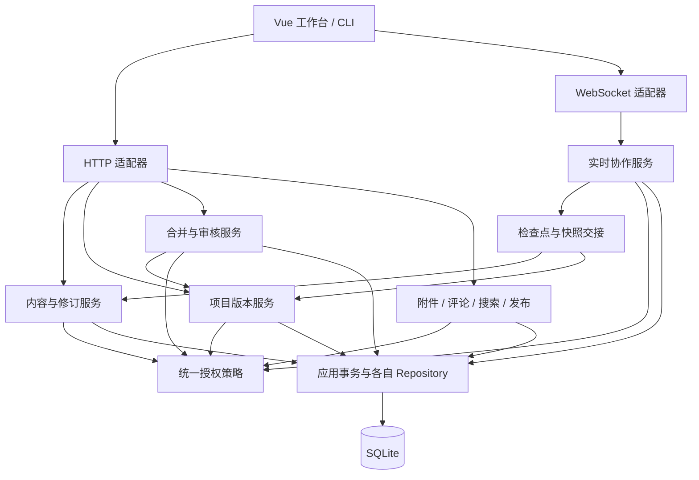

# 文档站架构与子系统开发路线图

研究日期：2026-10-08。代码基线：`569915a`，同时阅读当前工作树中的需求和设计文档。

P0/P1 的当前实现、语义和验证证据从[版本与恢复目录](版本与恢复/README.md)进入；具体确认结果见[决策记录](版本与恢复/决策记录.md)。

状态：**供确认的架构建议，不是已批准的实施规格**。本次只研究和编写文档，没有修改程序、数据库或部署。已确认的产品边界：**第一版一个工作区对应一部作品，章节、人物和世界观设定共同参与快照和分支**。其余新技术选型和重要边界仍需在实施前确认。

本文服务于朋友之间共同创作架空小说的文档站：日常编辑要可靠，阶段成果要可追溯，不同故事方案要能独立演进并经审核合并。保留现有 Vue、CodeMirror 6、FastAPI、SQLite 基础；新增服务先作为清晰的模块，是否独立部署另行决策。

## 1. 结论与开发顺序

用户提出的顺序合理。结合代码现状，建议把“版本化保存”调整为“补齐已有版本内核的用户闭环”，并将分支与合并拆成两个可独立验收的阶段。

| 阶段 | 交付内容 | 完成后的实际能力 | 进入下一阶段的条件 |
| --- | --- | --- | --- |
| P0，随第一阶段完成 | 作品边界、显式数据库升级、历史访问规则 | 后续数据模型可以在已有内容上演进 | 范围和历史策略明确，升级可备份、验证、失败回退 |
| P1，现在 | 修订归因、历史浏览/比较/恢复、本地草稿 | 保存过的正文可追溯；旧页面不能覆盖；关页后有机会恢复本机草稿 | 恢复追加新修订，冲突与响应丢失不丢本地稿 |
| P2，紧接着 | 项目快照、线性阶段提交、整项目恢复、内部里程碑 | 同时固定正文、目录、名称、顺序和内容 metadata | 原子捕获、不可变历史、整体恢复成立 |
| P3，随后 | 最小实时协作、可靠持久化、协作到项目快照的交接 | 同分支多人编辑，重启可恢复，阶段提交包含确定内容 | 持久化确认、断线重连、撤权、快照边界均成立 |
| P4 | 从提交创建分支、切换、比较 | 独立探索故事方案，分支草稿互不污染 | 分支身份、授权、协作房间及本地缓存完全隔离 |
| P5 | 三方合并、合并请求、审核与回复、原子应用 | 来源成果经检查后合入目标，保留双亲历史 | 冲突有类型，预览过期会失效，不覆盖目标草稿 |
| P6 | 正式发布、定时发布及进一步的权限产品化 | 读者看到固定版本，作者继续编辑下一版 | 发布快照、附件保留和访问规则完整 |

以下能力穿插交付，不应全部堆到主线末尾：

| 子系统 | 最早合适的时间 | 初期边界 |
| --- | --- | --- |
| 统一权限 | P0 起，贯穿每阶段 | 复用已有入口；历史、提交、协作、合并分别补能力检查 |
| 本地草稿 | P1 | 按账号和完整内容范围隔离；P3 演进为协作离线缓存 |
| 图片与附件 | P2 后尽早，正式发布前必须完成 | 上传、不可变媒体版本、引用、鉴权下载、快照保留 |
| 文档级评论和回复 | P1/P2 后可交付 | 绑定文档身份，明确分支/修订语境；先不做漂移选区 |
| 搜索、标签、反向链接 | P2 后可交付 | 当前分支的稳定正文投影；查询时再鉴权；索引可重建 |
| 精确行内评论 | P3 后 | 活跃草稿相对位置 + 固定修订锚点 + 失效状态 |
| 权限组、例外管理 UI | P2–P5 按实际协作需求推进 | 先扁平群组，再评估嵌套；保留已有继承和私密语义 |
| 模板、人物卡、主页、匿名活动 | 内容与权限基础稳定后 | 复用版本、发布和展示策略，分别设计，不挤入核心主线 |

不按日历估算这些阶段。实时协作持久化、历史授权和树合并的复杂度取决于明确的产品规则，应以阶段出口作为排期依据。

## 2. 当前基础：哪些已经有，哪些仍缺失

以源码为准。部分旧导览仍描述早期 Web 原型或旧服务内部布局，不应直接当作当前能力清单。

| 能力 | 已实现的基础 | 尚缺的闭环 | 证据 |
| --- | --- | --- | --- |
| 文档身份和目录 | `objects` 保存稳定 ID；`entries` 按工作区/分支记录父目录、名称、顺序及当前正文指针 | 作品根的明确契约、多工作区入口、历史树 | [schema](../src/storage/schema.py)、[模型](../src/core/models.py) |
| 版本化保存 | 正文修订不可变，记录操作者/来源；历史列表/比较/正文恢复与固定操作回执已实现，先比较 revision 再追加 | 项目级快照和版本图仍待后续 | [save_document](../src/services/content_operations.py)、[ContentService](../src/services/content.py) |
| 并发保护 | 正文 revision、结构 version、递归删除 subtree token；短事务；跨进程竞争已有测试 | 新增项目级操作的并发令牌、幂等请求结果 | [事务](../src/services/unit_of_work.py)、[并发测试](../tests/test_content_concurrency.py) |
| 身份和授权 | 账号、会话、成员 reader/editor/admin/owner、ACL、祖先可读检查、私密、冻结 | 群组、分支管理能力、审核工作流、WS 撤权 | [策略](../src/access/policy.py)、[授权服务](../src/services/access.py) |
| 编辑器 | Vue + CodeMirror 6；Markdown 预览；IndexedDB 本机草稿与 Web Locks/fencing；冲突保稿、请求代际和账号隔离；旧 HTML／JS 工作台仍用内存草稿 | 协作绑定、同步状态和协作撤销 | [文档协调器](../frontend/src/state/document-session.ts)、[编辑器](../frontend/src/components/MarkdownEditor.vue) |
| 项目版本 | `branches` 表及 scope 已预留 branch_id | 没有项目提交表、快照清单、提交父图、分支创建/切换 | [schema](../src/storage/schema.py)、[服务器固定 scope](../src/server/app.py) |
| 实时协作 | 有目标设计，尚无实现 | 房间、协议、日志、检查点、确认、恢复、快照交接 | [既有目标设计](协作与版本设计.md) |
| 运维数据保护 | SQLite 在线备份、WAL、显式初始化与旧容器导入；固定 Alembic 迁移链及协议 2 基线核验接管，停写后显式升级与只读核验 | 加入附件后的完整备份清单；真实容器与部署验证 | [备份](../src/storage/backup.py)、[迁移](../src/storage/migrations.py)、[管理命令](../src/storage/__main__.py) |
| 附件、搜索、评论 | `resource` 类型和部署 assets 挂载预留 | 尚无对应业务闭环 | [schema](../src/storage/schema.py)、[部署配置](../deploy/compose.yaml) |

两个需要避免的误判：`DocumentSnapshot` 是读取结果对象，不是项目历史快照；存在 `branches` 表也不意味着已经具备分支版本控制。

现有 `document_revisions` 已记录 actor_id、source_kind 与 restored_from_revision_id；历史沿请求分支当前父链验证。旧数据保留 unknown，不凭当前所有者推断。

## 3. 外部实现给出的参考边界

以下为官方文档和项目仓库核对结果；“对本项目的建议”是研究推论，不代表这些项目已经替本项目解决相同问题。

| 参考 | 可以直接借鉴的概念或组件 | 本项目仍须负责 |
| --- | --- | --- |
| Git | blob/tree/commit 的分离；提交父图；分支指向提交；共同祖先和三方合并 | 稳定文档 ID、目录顺序、ACL、共享草稿、附件、审核和事务 |
| Yjs | 并发文本更新、幂等合并、增量同步、CodeMirror 6 绑定 | 身份可信性、更新持久化确认、项目快照、跨分支语义合并 |
| HedgeDoc | Markdown 共同编辑的产品体验、修订浏览、文档身份与别名分离 | 多文档作品树、整体阶段提交、故事分支、目录继承权限 |

Git 的 tree 保存文件名与子树/内容引用，commit 关联树和父提交；这支持本项目将“内容状态”和“提交关系”分开。采用这套模型不要求把运行数据库改造成 `.git` 仓库。[Git Objects](https://git-scm.com/book/en/v2/Git-Internals-Git-Objects)

Yjs 更新具有交换性、结合性和幂等性，并可通过状态向量交换缺失更新。它解决副本收敛；产品中的“已保存”“谁有权编辑”“这次提交包含什么”仍需服务端契约。[Document Updates](https://docs.yjs.dev/api/document-updates)

现有 CodeMirror 6 可研究复用官方生态的 `y-codemirror.next`，无须为接入协作先更换编辑器。[CodeMirror 6 绑定](https://github.com/yjs/y-codemirror.next)

HedgeDoc 1 的官方说明使用 OT.js，不应把 HedgeDoc 各代统称为 Yjs 实现。HedgeDoc 2 的 Notes 页面明确标记为可能尚未全部实现的设计文档，其中区分 publicId、别名、修订、用户和群组权限。其加法式权限与本项目已有 allow/deny、目录继承并不相同，不能照搬。[HedgeDoc OT](https://docs.hedgedoc.org/dev/ot/)、[HedgeDoc 2 Notes 设计](https://docs.hedgedoc.dev/concepts/notes/)

Hocuspocus 可作为 Node 协作服务器候选，但默认存储钩子采用防抖。由此推论：接上该钩子并不自动满足“服务端确认成功的编辑在进程崩溃后仍然存在”，需另行明确持久化确认协议。[存储钩子](https://tiptap.dev/docs/hocuspocus/server/hooks)

## 4. 总体路线选择

| 路线 | 主要收益 | 主要代价 | 建议 |
| --- | --- | --- | --- |
| A：沿用 SQLite 内容内核，建立 Git 式项目版本模型，再接入 Yjs 生态 | 复用稳定 ID、事务和鉴权；能自然表达目录顺序和对象权限 | 项目快照、合并协调与授权仍需自己实现 | **推荐** |
| B：真实 Git 仓库作为内容权威存储 | 原生提交图、diff、merge、导出工具成熟 | 数据库权限与 Git 写入跨存储一致性；稳定 ID/顺序需额外清单；在线草稿仍需另一层 | 只有原生 clone/push 成为核心需求时再考虑 |
| C：将站点深度改造为 HedgeDoc 的扩展 | 可复用较多单文档协作体验 | 用户、权限、目录与现有内核融合成本高；作品级版本仍需自建 | 当前不推荐整体替换，可借鉴产品细节 |

推荐 A 是基于当前代码与需求的判断，不是对其他技术的普遍优劣判断。Git 导入/导出可以未来作为适配器增加，不必提前成为数据库权威。

SQLite 目前可以继续用。WAL 支持读写并行，但同一数据库同时只有一个写者；高频协作日志和大项目操作应保持短事务、测量写等待与确认延迟。只有出现具体容量或部署需求，再确认 PostgreSQL、Redis 或多节点架构。[SQLite WAL](https://www.sqlite.org/wal.html)

## 5. 对象与版本模型

建议固定以下术语，避免都叫“版本”。这是概念模型，不是要求一次性建完所有表。

| 概念 | 身份、范围与职责 | 是否可变 |
| --- | --- | --- |
| Workspace / 作品 | 一部作品的成员、内容和分支边界 | 设置可变 |
| Object | 文档、目录、附件的稳定身份；移动/重命名不换 ID | 身份不可变 |
| Entry / 工作树条目 | 某分支中对象的位置、名称、顺序、内容 metadata 和正文/附件指针 | 可变，带并发版本 |
| DocumentRevision | 一份稳定 Markdown 正文，记录保存/恢复/协作检查点来源 | 不可变 |
| CollaborationRoom | `(workspace, branch, object, epoch)` 的实时共享正文 | 当前状态可变，已接收日志追加 |
| RecoveryCheckpoint | 用于恢复的稳定正文及其协作日志位置 | 不可变，不要求作者填写提交说明 |
| ProjectSnapshot | 完整作品树及每个对象的内容版本清单 | 不可变 |
| Commit | 项目快照 + 父提交集合 + 操作者/说明/时间/来源 | 不可变 |
| Branch | 当前阶段提交 head + 独立工作树 + 草稿代际 | 指针可变，条件更新 |
| Milestone | “第一卷初稿”等指向确定 commit 的标记 | 初期固定指向；修正另建并审计 |
| Release | 指向确定 commit、声明发布范围和读者访问策略的记录 | 内容固定，撤回和访问控制另记 |

正文修订的 `parent_revision_id` 用于单文档来源追踪，不能代替项目的提交 DAG。合并提交需要两个父提交；建议 P2 就使用独立的提交父关系表示，开始只生成单亲提交。

第一版 ProjectSnapshot 推荐保存完整条目清单，正文仍引用现有不可变 revision，不逐次复制全文。规模证明有必要后，再讨论树节点内容寻址、结构共享和增量快照。先减少重建和验证复杂度。

清单至少固定：`object_id、kind、parent_id、name、position、内容 metadata、revision_id/asset_version_id`。哈希用于校验或去重，文档身份继续使用稳定 ID。完整快照中缺席即表示该阶段没有该对象；当前工作树可继续用 tombstone 保存删除信息。

ACL、成员、冻结、阅读计数、会话、评论状态不进入可恢复的内容清单。恢复旧稿不应顺带恢复过去的成员资格和授权。内容 metadata 与访问控制字段需要明确分开。

当前真实根下有 `main/admin/bin` 等兼容结构，UI 展示 `/main`。建议为作品登记稳定 `content_root_id`，初期映射现有 `main` 对象：它与其他入口传入的临时访问根区分开，项目快照不因调用者从哪个目录进入而改变。跨作品移动以后按“复制为新身份 + 删除”单独设计，第一版不开放保留原 ID 的跨作品移动。

## 6. 子系统与接口边界

| 模块 | 拥有的规则和数据 | 主要接口语义 |
| --- | --- | --- |
| 身份/授权 | 用户、会话、成员、群组、授权规则、权限解释 | `authorize(principal, action, resource_context)`；当前会话与策略快照 |
| 内容/修订 | 稳定对象、活动树、正文保存、单文档恢复 | `save(expected_revision)`、`list_history`、`restore_revision` |
| 项目版本 | 快照、commit、父关系、branch、milestone | `capture(expected_head, expected_generation)`、`restore_project`、`fork` |
| 实时协作 | 房间、epoch、CRDT 更新日志、持久化序号、恢复 | `accept_update`、`sync`、`capture_frontier`、`materialize_checkpoint` |
| 合并/审核 | 比较计划、冲突、解决记录、审批状态 | `plan_merge(base, ours, theirs)`、`resolve`、`apply(expected_heads, generation)` |
| 附件 | 不可变二进制版本、上传会话、引用与保留 | `upload/finalize/read`、快照引用校验 |
| 评论 | 线程、回复、固定/活动锚点、解决状态 | `create_thread/reply/resolve`；不隐式修改正文 |
| 搜索/关系 | 全文索引、标签索引、链接提取、处理进度 | 消费稳定内容变更，返回当前可见的结果 |
| 发布 | 固定提交、发布范围、发布时间、撤回 | `publish(commit)`；不直接指向活动工作树 |

接口名仅表达契约，不预先冻结 HTTP URL 或所有参数。身份解析可以继续由现有应用事务完成；新 WS 入口也必须复用同一身份与授权规则，不能凭握手时的前端状态判断写权限。

应用服务协调一次用例，Repository 只执行 SQL，算法接收纯数据。组合操作共享一个 UoW，不在外层事务中反复调用各自开事务的公开 `ContentService` 方法。现有 `ContentOperations` 已提供事务内操作模式，后续可沿此模式拆出版本和合并操作，无须重新搭框架。

搜索更新、通知、广播等事务外副作用，采用与业务写入同事务记录的待处理事件及可重试消费；直到出现第一个消费者时实现最小 outbox，不提前建设消息平台。每个消费者以事件/版本 ID 幂等处理。

## 7. P1：可靠保存、历史恢复与本地草稿

当前实现遵循[行为规范](版本与恢复/行为规范.md)：固定回执、本机事务先于发送、原生 Web Locks/fencing、独立历史区和恢复前处理草稿已接入；原生浏览器故障与真实 Docker 部署未验证。下文保留阶段目标，具体已实现接口以行为规范为准。

### 保存与历史

保留现有 revision 条件保存语义，增加分页历史列表、指定修订读取、两版差异、恢复预览。恢复操作明确携带 `source_revision_id` 和 `expected_revision_id`，验证来源属于该对象及允许访问的历史范围。

恢复 R1 时，若当前为 R3，应追加 R4：正文取自 R1，修订父记录指向 R3，另外记录 `restored_from=R1`。不把当前指针倒退，也不修改 R1–R3。恢复内容已与当前相同，可返回无变化，但仍记录必要的操作审计，不制造虚假正文差异。

新修订补作者/来源/操作标识；推荐新增关联 provenance 记录，避免修改已有不可变修订。协作检查点的触发者、参与者与原文作者是不同概念，后续不得把一个检查点的全部内容归功于触发保存的人。

保存请求增加幂等键或等价的结果查询机制：服务端提交成功但响应丢失时，同一账号和操作键应能取得原结果；同键不同请求拒绝。重试先重新确认当前访问资格，不把幂等缓存变成撤权后的读入口。界面在确认前保持“保存结果待确认”，不自动换成最新 revision 后重发本地全文。

### 本地草稿

建议 IndexedDB 保存 `{账号, 工作区, 分支, 对象, 基础 revision, 草稿, 本地更新时间, 请求标识}`。不存会话秘密；账号切换与退出时按明确规则隔离、清理或封存草稿，不展示给另一账号。恢复本地稿必须重新读取服务端状态并鉴权。

保留现有异步请求代际检查。加载历史预览不会悄悄替换正在编辑的 buffer；恢复、新开文档和切分支前处理未保存稿。多标签页以本地草稿代际避免互相覆盖。磁盘配额/浏览器清理可能导致本地保存失败，界面应有可观察状态和复制/导出出口。

### 升级与备份前置条件

当前管理入口只提供初始化和旧容器导入，不支持统一数据库的逐版本升级。第一次改表前，应增加显式 upgrade：先在线备份，再停止写入或进入维护窗口，事务执行升级、核对旧 revision ID/正文/身份关系，失败回滚。应用启动只验证版本，不自动迁移。不要要求已有作者通过“新建空库”获得新功能。

**P1 出口**：A/B 基于同一修订保存，后者冲突且保留本地稿；历史恢复产生新修订；保存响应丢失可确认结果；刷新可找回本机草稿；无权限者不能枚举历史。这里最后一项必须在历史接口上线时交付。

## 8. P2：项目快照与整项目恢复

### 快照捕获

在现有正文和结构都落在 SQLite 的阶段，可以在一个短写事务中：鉴权 → 比较 branch head 和工作树 generation → 枚举完整作品根 → 固定条目及 revision 引用 → 创建 commit → 条件更新 branch head。任一步失败整体回滚。

generation 必须由正文、metadata、重命名、移动、排序、新建和删除共同维护。不能只依赖根目录的 modified_at，也不能把若干独立 HTTP 读取拼成“同一时刻”。提交准备可以在事务外计算，最终写入再校验版本；不能在数据库锁内等待用户输入。

初期采用完整作品提交，不增加选择性暂存区。用户提交前看到相对 head 的变更摘要，并可填写说明。目录和排序变更与正文一样计入变更集。

同一作品含私密子树时，不能将调用者“看得见的目录列表”悄悄当成完整快照。第一版建议只有具备整作品版本操作资格且能访问全部范围的人执行捕获/整体恢复；不足时拒绝且不泄露隐藏条目。单文档编辑继续按原权限工作。

### 整体恢复

从旧快照生成恢复计划，比较预计被改动/移除/恢复的对象，检查冻结、权限和活动树合法性。先保存恢复前工作树为可找回的检查点，再以当前 head 为父创建新的恢复提交，原子替换活动树的对应状态。原本不存在于目标快照中的现有对象在工作树中退出活动状态，身份和历史保留。

一次事务更新 revision 引用、树、head、generation 和操作记录。恢复前检查点与最终状态不能出现只做了一半的结果。事务应支持交换名称/位置、移动父子结构等中间态约束问题：先验证最终树，再分步写入安全临时位置或使用经过设计的批量替换策略，最终外键、唯一性及无环约束全部成立。

恢复到旧项目状态不回退账号、ACL、私密标记或冻结状态。恢复出来但没有可安全解释权限的对象先保持不可见/受限，交管理员确认。

**P2 出口**：在保存、改名和排序同时发生时，快照仍是一个完整可说明的状态；继续编辑不改变旧提交；整项目恢复失败无部分结果；恢复前工作可找回；旧快照的名称、顺序和正文都可重现。

## 9. P3：实时协作必须包含可靠交接

### 技术候选与推荐

前端推荐评估 Yjs + `y-codemirror.next`。服务端有两条可行路线，需要到本阶段再确认重要依赖与部署边界：

| 路线 | 收益 | 风险与需要验证的内容 |
| --- | --- | --- |
| Python 进程内协作模块，采用 pycrdt/Yrs 和 WebSocket 适配 | 复用 FastAPI、UoW、SQLite 和统一授权，较容易保证一次持久化边界 | JS/Python 编码兼容、Unicode、更新回放、库接口与运维稳定性需要小范围技术验证 |
| Node 协作进程，采用原生 Yjs / Hocuspocus 等 | 原生 Yjs 生态，编辑器和服务端共享协议实现 | 增加服务、身份桥接、跨进程持久化确认和快照屏障；不能由两个服务各自维护正文权威 |

**建议先验证 Python 路线是否满足互操作与持久化要求，再决定是否采用。** Node 是明确备选，不因“Yjs 用 JavaScript”立即新增第二套权威存储。pycrdt 官方说明其为 Yrs 的 Python 绑定；pycrdt-websocket 提供房间与存储接入。[pycrdt](https://y-crdt.github.io/pycrdt/)、[pycrdt-websocket](https://y-crdt.github.io/pycrdt-websocket/)

这份研究未安装或执行这些库，不能据文档断言特定版本组合已经可用。选型验证需要覆盖真实更新互操作、重启回放、撤权和服务端文本物化。

### 最小房间和写入权威

每篇文档一个房间，键包含 `workspace_id + branch_id + object_id + epoch`。树、权限、提交与附件引用先走服务器命令及事务；不把整个作品和全部 ACL 塞进一个 Y.Doc。这样可以继续按文档授权、按需加载，并复用当前树约束。

启用协作后，活动正文的权威是**已持久化的 CRDT 状态与更新**，`document_revisions` 是稳定正文投影。所有修改入口必须统一：第一版可明确拒绝对协作文档使用旧式全文 PUT，并保留 CLI 读取/导出；需要 CLI 写入时，再经同一个协作写入通道提交。不得让 REST 全文覆盖和 CRDT 日志同时独立改同一正文。

服务端仅一次性为新 epoch 初始化 CRDT。正常重连从已存二进制恢复，不能每次把 Markdown 重新灌入新 Y.Doc。Hocuspocus 持久化指南也明确要求保留 Yjs 二进制，反复重建可能造成重复内容。[持久化格式](https://tiptap.dev/docs/hocuspocus/guides/persistence)

### 持久化与确认

推荐顺序：验证会话、当前权限、房间 epoch 与更新边界 → 校验可接收的更新 → 在短事务中追加日志并分配持久化序号 → 提交成功 → 广播及返回持久化确认。失败不得返回“已保存”；接收过程中形成的内存状态必须能丢弃并从日志重建，不能把失败内容混进后续成功快照。

协议要区分本地已写缓存、网络已同步、服务端已持久化、已纳入阶段提交。标准 provider 的 `synced` 不能直接作为本站的持久化凭据；更新日志序号/确认需要在 provider 外围协议中定义。[y-websocket API](https://docs.yjs.dev/ecosystem/connection-provider/y-websocket)

每条日志关联接收主体、房间、epoch、操作键、序号及二进制更新；客户端 CRDT clientID 不是可信账号身份。状态向量用于同步，不能当作完整内容指纹或唯一持久化凭据；删除变化与必要 CRDT 状态也要保留。尚有未解析依赖的更新不能宣称已经变成可物化的正文，应补齐依赖或明确阻止相应提交。

成功接收协作变更也必须使分支草稿 generation 前进，或者提供覆盖所有房间持久化位置的等价令牌。否则合并预览之后的实时修改不会被最终并发检查发现。可靠确认还需要明确 SQLite 的同步配置与磁盘持久化语义，进程重启可恢复和主机断电可恢复分别验证，不凭启用 WAL 就作出更强保证。

Awareness 的在线状态和光标单独处理，不纳入正文版本。只读连接只能接收被授权内容；会话撤销、移出成员、冻结或撤销阅读时，必须重新检查更新资格并及时停止相应广播/关闭连接，不能只在首次握手检查。[Yjs Awareness](https://docs.yjs.dev/getting-started/adding-awareness)

### 从协作状态生成确定的项目快照

正文分布在多个房间后，“把每个房间现在的文字读一下”不能保证项目一致性。推荐引入持久化截点：

1. 发起提交的客户端先等待自己的待发送更新得到持久化确认；其他离线客户端尚未送达的内容明确不包含。
2. 在一个数据库事务中捕获结构清单、branch head、草稿代际，以及每个文档的 `(epoch, durable_sequence)`，形成不可变 capture 记录。这要求协作接收日志与结构命令有共同可解释的持久化顺序。
3. 从对应 CRDT 基线和日志前缀物化每篇正文。后续更新继续写入当前草稿，不混进这个 capture；日志压缩在 capture 完成前保留其依赖。
4. 核对全部正文、结构和附件引用；重新检查授权和 branch head 后，原子发布快照/commit。若别人先创建了新阶段提交，重新准备或报告过期，不悄悄更换父提交。
5. 完成后，晚于截点的编辑仍为未提交草稿。界面可准确显示“本次提交之后还有新修改”。

这个协议允许长一些的正文物化在数据库事务之外完成，避免持锁等待所有房间。第一版也可选择短暂的分支写入屏障完成捕获，但屏障覆盖所有写入入口，等待失败必须释放，且不能把等待期间的新编辑误标为已提交。采用独立 Node 服务时需另行设计跨进程的持久化 capture 协议。

### 恢复、压缩和编辑器边界

恢复旧正文、整项目恢复、合并应用都可能替换活动文本。第一版建议新建 epoch、封存旧房间并重连；迟到的旧 epoch 更新明确拒绝并保留为个人可找回草稿，不能自动混入恢复后的正文。P4 新分支也从稳定正文初始化自己的协作代际，不连接来源活动房间。

接入协作时，应替换当前“props 变化就全文替换 CodeMirror”的同步方式，使用增量绑定；撤销按本地来源处理，避免撤销他人的编辑。中文输入法组合态、选区、实时预览装饰和账号切换要沿用现有编辑器约束。

CRDT 合并日志和垃圾回收不是业务历史保留策略。Yjs 文档说明 GC 会影响旧内容恢复；离线缓存可以借助 IndexedDB provider，但它不替代服务端保存。[Y.Doc](https://docs.yjs.dev/api/y.doc)、[离线支持](https://docs.yjs.dev/getting-started/allowing-offline-editing)

现有需求要求纯文本保留全部历史版本。在未确认“历史版本”指每个已接收更新还是每个恢复检查点前，不上线有损历史清理。推荐先保留已确认日志和全部稳定修订；未来做冷归档/压缩时，验证历史重放能力，而不是只验证最终文字相同。

**P3 出口**：两个真实协议客户端并发收敛；重复更新幂等；已确认更新进程重启后存在；落盘失败不确认；撤权后拒绝写入并停止越权读取；提交明确排除截点后的更新；旧 epoch 不污染恢复结果。重点用协议与服务测试，UI 默认只截图查看，不自动点击或填表。

## 10. P4–P5：分支、三方合并和审核回复

### 先交付分支

分支从确定 commit 创建；同一文档在不同分支继续使用同一个 object_id，方便识别重命名和移动，但 entry、当前内容指针和协作房间分开。新建副本文档才分配新 ID。切分支前处理本地未送达更新；客户端缓存键和在途请求代际包含分支与 epoch。

本阶段需要将服务器启动时固定的 `services.scope` 演进为请求级、经过鉴权的工作区/分支上下文；默认工作区仍可作为兼容入口。用户传入 branch_id 只是资源选择，不是授权。多作品创建/选择 UI 可以另行交付，不是先完成单作品分支的必要条件。

先提供分支创建/切换、相对祖先或另一提交的比较。分支访问规则必须在创建时明确，不因来源带有私密文档就向目标成员自动公开。初期可以限制分支创建权限并沿用来源的当前限制；不能仅复制正文而忽略访问约束。

### 合并输入和算法层

合并只处理固定的 `base/ours/theirs` 三份项目快照。来源先形成阶段提交；目标共享草稿相对 head 不干净时，第一版阻止应用，要求提交或显式保存到可找回的分支/检查点。不要自动 stash 后猜测恢复效果。

从 commit DAG 找最佳共同祖先。没有共同祖先时拒绝常规合并；出现多个最佳共同祖先时，第一版明确报告暂不支持自动合并，不任意挑一个。以后再引入虚拟 merge base。Git 官方文档确认交叉合并可能产生多个最佳共同祖先。[git-merge-base](https://git-scm.com/docs/git-merge-base)

先按 object_id 比较树，再分别合并正文与字段。基础规则是：ours 等于 base 则取 theirs，theirs 等于 base 则取 ours，两边相同则取该结果；其余进入文本算法或结构冲突规则。Markdown 初期采用成熟的行级 diff3 实现并提供人工处理；具体库在 P5 选型确认，中文长段落可先标整段冲突，再改进字词级展示。

| 冲突类别 | 例子 | 第一版处理 |
| --- | --- | --- |
| 文本重叠 | 同一段人物动机被两边改写 | 三栏比较，人工生成结果正文 |
| 删除/修改 | 一边删章节，另一边补写该章 | 明确选择保留/删除；不静默取删除 |
| 重命名/重命名 | 同一文档两边改成不同名称 | 选择或填写最终名称 |
| 移动/移动 | 同一文档两边移到不同目录 | 选择最终父目录，并检查无环 |
| 父目录删除/子树修改 | 删人物目录与修改其中档案并发 | 作为结构冲突整体解释 |
| 名称占用/新增冲突 | 不同 ID 的两个新增文档使用同一路径 | 保留为不同对象，人工调整名称/位置 |
| 顺序冲突 | 两边重排章节导致约束不相容 | 选择/调整最终兄弟列表；不对整数 position 做文本合并 |
| metadata/附件冲突 | 同一设定字段或插图两边不同 | 按字段策略或版本选择；二进制不自动拼接 |
| 权限/冻结阻断 | 当前操作者已失去目标写入权 | 阻止应用，不能通过“解决文本冲突”绕过 |

目录顺序第一版以完整兄弟列表比较，单边改取单边，双边不同则要求选择；后续再考虑相对顺序约束图和拓扑排序。最终树还必须检查孤儿、环、重复名称、重复位置、内容类型与资源引用。

### 计划、审核和最终应用

合并预览是纯计算结果，不改活动内容。保存 `MergePlan`：来源/目标 commit、base 集合、目标 generation、冲突和解决结果、算法版本。回复和审核绑定这份比较版本；source/target 更新导致旧结论过期，不能沿用对旧 diff 的批准。

应用前先取得分支写入屏障或等价 fencing，重新验证来源/目标 head、草稿 generation、权限、冻结和审核状态。差异计算与人工编辑在事务外完成，最终在一个短事务内写入新正文版本、完整结果树、快照、双亲 merge commit、目标 head、epoch 切换及审核完成状态。

提交后再通知协作客户端重连。若通知失败，数据库的新 epoch 仍会阻止旧客户端继续写，通知可重试。任一前置条件变了都使计划失效，重新比较。成功响应丢失通过操作幂等键查询既有结果。

审核资格独立于编辑资格。具备编辑权只能改草稿，不天然获得合并/发布审批权；具备 review 也不当然具备绕过目标写入限制的权力，应用用例需要单独定义组合授权。

回复先使用简单的审核线程；评论中的“同意”不等于系统批准。行内审核意见绑定确定提交和差异位置，来源更新后显示“针对旧版本”。文本自动合并成功仍保留对剧情和世界观一致性的人工审核。

**P4 出口**：分支从旧 commit 正确分叉，编辑和本地缓存隔离，比较识别对象移动。

**P5 出口**：单边更改自动处理，复杂冲突明确返回；预览后目标变化导致应用失败；未提交草稿不被覆盖；事务失败不产生半个合并；重复申请不会产生重复 merge commit。

## 11. 权限与历史可见性

当前最小权限入口已经存在，后续重点是所有新服务都使用它，并解释新操作。新增能力建议包括 `history.read、history.restore、commit.create、branch.create、merge.review、merge.apply`；与现有 edit/review/publish 的映射要有明确表格，不能在页面组件里硬编码角色判断。

推荐历史访问采用**当前身份和当前授权约束**，不按“当年能看”继续放行。当前能读某篇文档，也不自动代表能读其全部历史或某个私密分支的同对象修订。历史读取需验证：工作区成员/可见范围、分支、对象、历史能力、修订在所声明历史上下文中的可达性。

建议初期恢复历史只向具备相应编辑/管理资格者开放；普通读者看到当前内容或显式发布的版本。已删除对象需保留可解释的授权上下文；若当前目录链已不存在，第一版限作品管理员恢复，不能根据裸 revision_id 越过策略。树恢复、移出私密目录、新增历史权限是否允许访问更早的敏感内容，应在 P0 策略中明确；有疑义默认拒绝，后续可用明确的历史可见区间授权。

项目级历史包含文件名、目录结构、数量、提交说明和作者等信息。仅过滤正文不足以保护私密内容。第一版限制完整快照接口；以后需要部分可见视图时，服务端生成经过授权的展示投影，并避免泄露隐藏路径、总数和差异摘要。

权限组扩展建议沿用当前“最近对象层优先，再按主体优先级解释”的基础，新增群组时明确同层多个群组如何决议。候选是同层群组 deny 优先，用户特例与角色的相对顺序另行确认；不要无意改成全局 deny 优先或简单权限相加。保留祖先可读要求、private 约束和独立冻结语义，提供“为什么允许/拒绝”的解释。

群组先扁平化；嵌套引入环检测、成员展开和缓存失效，等实际需要时再设计。HTTP、WS、附件下载、评论、搜索、历史读取、发布都必须有当前策略版本的失效机制。已经下载到用户设备的内容无法通过撤权收回；服务器能保证的是停止新的授权读取和写入。

## 12. 附件、评论、搜索与发布如何接入

### 附件与版本保留

附件逻辑身份、不可变 asset_version、二进制 blob 分开。上传先写临时对象，校验长度/类型/哈希并可靠落盘，再以事务登记可引用版本；失败留下的临时对象可清理，不能生成指向不存在文件的正式版本。初期可以评估现有 `/assets` 本地挂载，S3 等对象存储为另一个待确认部署选择。

阶段快照引用确定 asset_version，阅读旧 commit 时解析固定版本，不能经“图片最新版本”链接改变旧稿。项目内链接优先以稳定 object_id 表达，当前视图按分支解析，历史视图按快照解析；外部 URL 不在本站历史完整性保证内。

“只保留最近 N 个媒体版本”与“旧提交可完整恢复”存在约束冲突。推荐：被任一保留提交、里程碑、发布或恢复记录引用的 blob 不回收；N 只作用于未被保留历史引用的候选版本。若要强制删除被历史引用的媒体，必须显式接受历史不完整，并在旧稿中显示缺失信息。

附件读取重新鉴权，私密图片不暴露为绕过权限的永久公开静态链接。备份扩展为数据库快照 + 该快照引用的 blob 清单及文件，期间固定引用、防止并发 GC；只有 SQLite 备份不足以恢复带媒体的作品。

### 评论与回复

文档级线程依赖稳定 object_id，可提前上线。每条线程记录 workspace、branch，以及可选 revision/commit；评论编辑和删除需要自身的并发与审计规则，不能把评论直接塞入正文 metadata。回复、解决、重新打开是评论域行为。

活动草稿行内评论可使用 Yjs RelativePosition；固定版本评论使用 revision/commit + 原文片段/范围。跨 epoch 或跨分支时不可假设旧相对位置仍有效，需重新锚定或标记“原位置已失效”，保留引用文字以便判断。[Relative Positions](https://docs.yjs.dev/api/relative-positions)

### 搜索、标签和反向链接

索引是可重建的投影，首版只索引当前分支的稳定正文/检查点，说明协作编辑到搜索出现有延迟。用 revision 或 checkpoint 标识幂等更新，重命名、移动、删除和撤权也要使结果及时失效。查询结果、片段、计数和补全均不可泄露无权访问的文档。

可以评估 SQLite FTS5，但中文小说检索不能把默认 tokenizer 直接视为可用结论。unicode61、trigram 或中文分词各有短查询、词边界和部署取舍，应以作品中的姓名、两字词、短句样本验证后选定；第一版可以先交付受权限约束的标题搜索。[FTS5 tokenizers](https://www.sqlite.org/fts5.html)

Markdown 链接提取与标签读取同样消费稳定版本。反向链接保存来源对象及修订，展示前分别检查来源与目标权限。关系图是查询结果的一种展示，不需要独立成为内容权威。

### 发布与匿名展示

内部里程碑可在 P2 交付，正式发布在附件、授权与固定版本读取齐备后实现。发布固定 commit 或经审核的发布清单，后续写作不会改动读者所见正文。定时发布在真正生效时重新检查发布权限和目标存在性。

匿名活动作为身份展示策略：正文、历史、评论、协作光标、审计接口和附件 metadata 都可能暴露作者，需一致处理。真实审计身份保存在服务端，普通读者获得脱敏视图。执行式个人主页、模板扩展、富媒体格式是独立需求，避免顺带引入到本轮版本内核。

## 13. 阶段验证与实施拆分

| 阶段 | 首选验证层与关键证据 | 不扩大到 |
| --- | --- | --- |
| P1 | 现有内容服务/并发测试；真实 SQLite 恢复与幂等；编辑状态和本地草稿边界 | 重写全部编辑器测试，浏览器自动流程 |
| P2 | 项目服务事务测试；并发快照；树合法性；故障回滚和旧状态可重建 | 提前做分布式快照或增量存储引擎 |
| P3 | 真实 CRDT 编码互操作、协议客户端、持久化故障、重启与撤权 | 用 mock 广播成功代替持久化证明 |
| P4 | 分支来源、历史可达性、房间/缓存隔离 | 提前实现完整合并策略 |
| P5 | 纯算法的有代表性冲突；真实数据库最终应用与失败回滚 | 在 HTTP、服务、DAO 层机械复制同一场景 |
| 附件/搜索/评论 | 引用与回收、授权、不重复处理、锚点失效等独立风险 | 为文案和布局新增永久测试 |

每阶段先运行相关已有检查，仅为具体新行为和覆盖缺口加短小测试。页面默认截图验证；需要自动交互流程时另征得用户明确要求。数据完整性测试需要实际调用生产逻辑并独立断言，不用源码字符串或常量对照代替。

建议每阶段一份规格和一份适度拆分的实施计划。P1 可以按“升级/来源记录 → 历史读接口 → 恢复命令 → 本地草稿和历史 UI”交付；P2 按“快照模型 → 捕获/读取 → 比较 → 整体恢复”交付；P3 必须将协议、持久化和截点一起视为最小闭环，不把“能看到别人打字”当作完成。

运维观测随对应功能增加：保存失败与冲突、SQLite 写等待、协作确认延迟/待落盘更新、捕获失败、合并计划过期、附件缺失、索引落后。阈值由实际负载决定，不先承诺未经测量的并发人数。

## 14. 待确认决策与本次研究范围

| 决策 | 推荐 | 何时必须确认 |
| --- | --- | --- |
| 作品与工作区关系 | 一工作区一作品 | **本轮已确认** |
| 内容权威与整体路线 | 保留 SQLite，扩展项目快照/提交模型 | P1/P2 规格实施前 |
| 作品根和快照表示 | 显式 content_root，首版完整清单 + revision 引用 | P2 建模前 |
| 历史访问策略 | 当前授权 + 独立历史资格 + 上下文可达性；删除历史先限管理 | 历史接口开放前 |
| 实时协作依赖和部署 | 优先验证 Python/Yrs 方案，Node/Yjs 作为备选 | P3 技术验证前确认验证方案，正式接入前确认选型 |
| 协作持久化与截点 | 服务端可靠存储后确认；持久化 frontier 捕获 | P3 协议实现前 |
| 历史保留粒度 | 未确认前不做有损日志清理 | 协作日志 GC/归档前 |
| 合并策略 | 固定快照三方合并，脏目标阻止应用，复杂共同祖先先拒绝 | P5 算法实现前 |
| 群组规则与媒体保留 | 明确群组优先级；历史引用媒体不受简单 N 份清理 | 对应子系统实施前 |

P0/P1 已按确认路线实现，分支最终审阅与交付状态以执行记录为准。P2–P5 的概念和边界提前对齐，详细字段、库版本、HTTP 路由和实现任务留到各阶段设计，不一次性锁死全部细节。

本次核对了需求、既有协作设计、schema、保存和事务链路、访问策略、前端状态/编辑器、服务器 scope、备份与部署，以及文中链接的官方资料。已有测试仅阅读定位，未运行应用测试、库互操作实验、性能测试或浏览器流程；本文中的阶段出口是未来验收标准，不是本次已经通过的验收结果。
