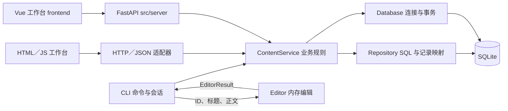

# 项目分层与入口

C156 的目标是供用户共同创作和阅读内容的网站。抽象文件系统负责组织内容；CLI、Vue + FastAPI 与本地 HTML／JS 工作台是并列入口。CLI 的 `ls`、`cat`、`edit` 等命令只是终端交互方式，不定义网页 API，也不是内容对象自身的接口。

第一次阅读代码，先看 [代码导览](代码导览.md)：其中有五个核心文件的阅读顺序、完整文件职责表、保存调用链和测试定位。本页解释各层边界与当前实现范围。

## 当前分层

```text
src/
├── core/       文件／目录纯模型、虚拟路径词法、领域错误、JSON 规则
├── storage/    SQLite schema、连接／事务、Repository，以及显式初始化／迁移
├── services/   身份、账号、授权与内容用例及统一 ApplicationUnitOfWork
├── cli/        命令解析、cwd 会话、补全、提示、输出和编辑保存协调
├── editor/     终端交互与内存文本 buffer，返回纯编辑结果
├── server/     新 FastAPI HTTP 适配器；独立传输、认证与严格 JSON 契约
├── web/        本地 HTTP／JSON 适配器与 HTML／JS 文档工作台
└── file/       已弃用的兼容入口；不再包含 Document／Folder／SqlFile 实现
```



图中是操作调用关系：服务通过 ApplicationUnitOfWork 申请本次短事务，在同一快照解析会话、成员与 AccessPolicy 策略，再把同一连接交给各 Repository。读用例用读事务，写用例用 BEGIN IMMEDIATE；事务内服务不重连、不 commit。core 为各层提供纯模型和规则，不反向调用存储或入口。Editor 不直接调用 ContentService，也不读写数据库；CLI 负责读取与最终保存。

- **入口**：CLI 管理 cwd、补全、命令解析与展示。编辑器只接收文档 ID、标题和正文并返回编辑结果，不持有持久化对象。网页使用结构化 JSON 操作，由 HTTP 适配器转交 ContentService，不调用 CLI 或终端编辑器。
- **ContentService**：执行范围、类型、保护、版本与业务规则，组装纯数据快照；每次操作拥有一个短读事务或 `BEGIN IMMEDIATE` 写事务。服务不写 SQL，不依赖入口。
- **Repository**：执行参数化 SQL，按工作区和分支过滤；共享服务提供的连接，不自行 begin／commit／rollback、重连、初始化 schema 或调用服务。
- **Database**：负责连接、事务、外键、5000ms busy timeout 和运行配置验证。运行打开拒绝缺失、未知版本及非 WAL 数据库，不隐式修改。
- **演示入口**：`run_demo.py` 显式准备独立的示例库并启动 Web；重复启动保留内容。`run_web.py` 只打开指定的已就绪库。
- **管理入口**：显式 init 或 migrate-legacy；初始化与迁移发布后完成 WAL 配置。旧 bootstrap 只转发显式 init。旧单容器读取集中于离线迁移模块。

`frontend/` 包含 API 类型／客户端、纯状态和 Vue 展示组件；只依赖 HTTP 契约，不接触数据库。`src/server` 直接调用 IdentityService 与 ContentService，不导入旧 Web API、CLI、Repository 或 sqlite3。新旧 HTTP 入口并列保留，默认库与管理命令一致；新入口不含旧页面的预览、新建和账号／访问管理。

## 目标扩展边界

当前已实现身份、账号、授权和内容服务及本地入口；实时协作仍是后续能力。它们应沿用现有边界，而不是把身份或网络状态直接塞进 `ContentService` 或网页脚本。

```text
Web HTTP／WebSocket ─┐
CLI／后台任务        ─┴→ 应用服务层
                       ├─ IdentityService：用户、凭据、会话
                       ├─ AccountService／AccessService：账号与访问管理
                       ├─ AccessPolicy：集中角色／ACL／私密／冻结策略
                       ├─ ContentService：目录、文档、metadata、正文检查点
                       ├─ CollaborationService：房间、同步、更新、快照
                       └─ PublicationService：阶段提交、发布、审核
                                  ↓
                 core 领域规则 + storage Repository／Database
```

### 身份、访问范围与授权

`ContentScope` 只表示工作区、分支和访问根，限制“可以遍历哪棵内容树”；它不是用户身份，也不是权限凭据。服务调用必须显式传入 session_token，由同一事务解析 Principal，再由授权服务判断该调用者是否能执行读取、编辑、创建、删除、重命名、审核或发布。

- `core` 可以定义 `Principal`、角色、权限值对象和纯授权规则，不依赖 HTTP、Cookie 或密码库。
- `storage` 保存用户、凭据摘要、会话、工作区成员关系、角色和 ACL；即使初期继续使用同一个 SQLite 文件，也应使用独立表和 Repository。
- `services` 负责认证、会话生命周期和授权决策，CLI、HTTP 和 WebSocket 共用同一套服务。
- `web` 只负责登录页面、Cookie／Token、CSRF、请求上下文和错误映射；不能自行查询权限表或把客户端传入的 `user_id` 当作授权结果。

### 实时协作边界

实时协作不是 `save_document()` 的高频版本。协作服务负责接收和合并更新、维护房间和同步状态，并把稳定状态生成检查点；WebSocket 只负责连接和消息传输，前端负责编辑器绑定、本地队列、断线重连和在线状态展示。

- `core` 可放与传输无关的更新类型、版本向量、幂等和合并规则。
- `storage` 后续保存协作更新日志和协作快照；现有 `document_revisions` 继续表示稳定正文，不承担逐字符操作日志。
- `services` 负责房间授权、同步、快照压缩和从协作状态生成内容检查点。
- `web` 负责 WebSocket 握手、心跳、限流和消息 framing；浏览器编辑器与该协议深度绑定，但不能绕过协作服务写数据库。

账号与授权已和内容表共享同一个 SQLite 文件及事务；协作尚未实现，也可以沿用该边界，以保留事务一致性；Repository 和服务边界必须独立，未来才有条件把会话、更新日志或消息分发迁移到专用存储。

入口统一通过服务读取、创建和保存；CLI 不扫描宿主机内容目录，编辑器只可读取自身静态帮助。初始化返回工作区根 scope，而 CLI／Web 的默认 scope 以 main 文件夹为虚拟 `/`。Web 固定服务器 scope，客户端不能指定工作区、分支或访问根。所有按 ID 操作同样检查活动访问根，root_id 不代表用户权限。

### 文件模型与文件层服务的区别

`core/models.py` 的 NodeSnapshot、DocumentSnapshot 和 ContentScope 是纯数据。它们没有数据库连接、SQL 属性、content setter 或自动保存行为。对象稳定身份、分支内目录状态和正文修订分别存放在 objects、entries、document_revisions 表中；虚拟目录不对应宿主机目录。

`services/content.py` 的 ContentService 才是共用文件层服务，提供解析路径、列目录、创建、读取、保存、metadata、重命名、移动与软删除等操作。调用者传 scope 和对象 ID；服务决定业务规则和事务，Repository 决定如何执行 SQL。CLI 和 Web 使用同一服务。

网页侧的文件与事件接线见 [工作台开发](工作台开发.md)。HTTP 层只适配 JSON 请求，内容服务统一执行范围与版本检查。

例如 `cat` 的链路是 CLI 解析路径 → ContentService 读取文档 → Repository 查询 → SQLite。`edit` 的链路是 CLI 先通过服务读取 → Editor 在内存编辑 → CLI 接收结果 → ContentService 用最初 revision_id 保存。编辑期间没有数据库事务一直打开。

正文以不可变修订保存，revision_id 检测正文冲突；entry.version 检测结构与 metadata 冲突，子树 token 检测递归删除确认后的并发变化。服务不自动重试领域冲突。终端编辑、确认和等待均处于事务外；失败 buffer 保留原基础修订，不能自动绑定最新版本覆盖他人内容。

### 当前组织上的整理空间

调用边界由 `tests/test_architecture.py` 的 AST 检查覆盖，包括入口不导入 DAO／旧容器、服务不写 SQL、不导入入口、DAO 不自行管理连接或事务。

模块内部仍有集中较多职责的文件：`services/content.py` 同时容纳公开操作和私有范围／路径／快照辅助；`storage/repository.py` 包含运行 DAO 与管理核对；`storage/legacy.py` 同时包含只读扫描和导入协调。后续可按这些责任拆内部模块，保持 ContentService 作为入口的公开边界。`src/file` 是历史兼容壳，完成旧调用者迁移后可以删除。

## 后续协作与版本能力

实时共享草稿、作品级提交、分支和审核合并的目标关系见 [协作与版本设计](协作与版本设计.md)。这些能力与当前的手动正文保存分别实施。

## 当前实现范围

单 SQLite 协议 2、共用 ContentService、CLI／编辑器接入、本地 HTML／JS 工作台、离线迁移、正文修订、严格 metadata、移动／重命名与软删除均已实现，身份、站点账号、默认工作区角色、ACL、私密与冻结已接入 CLI／Web。运行库和 sidecar 不纳入代码 Git；旧 data 样本保留。CLI 继续保留原命令集合；Web 支持浏览、新建和正文读写，其他内核操作通过 Python API 使用。

后续设计中的 CRDT、分支创建／切换、提交图、媒体框架及用户历史浏览／正文或删除恢复尚未交付。Web 是仅监听 loopback 的演示入口，不是生产站点服务。后续 WebSocket 和协作入口仍应通过应用服务访问内容内核。bin 为兼容顶层目录，不是自动回收站。
